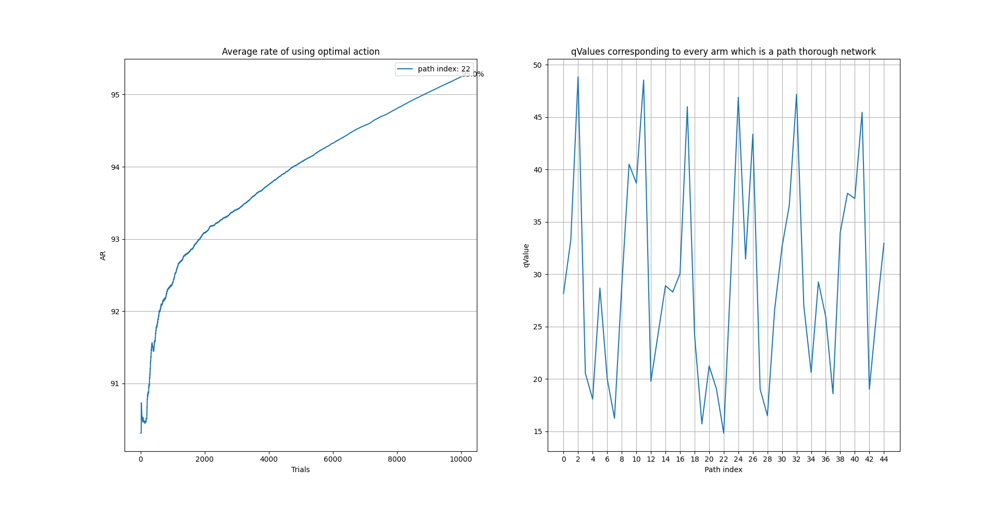
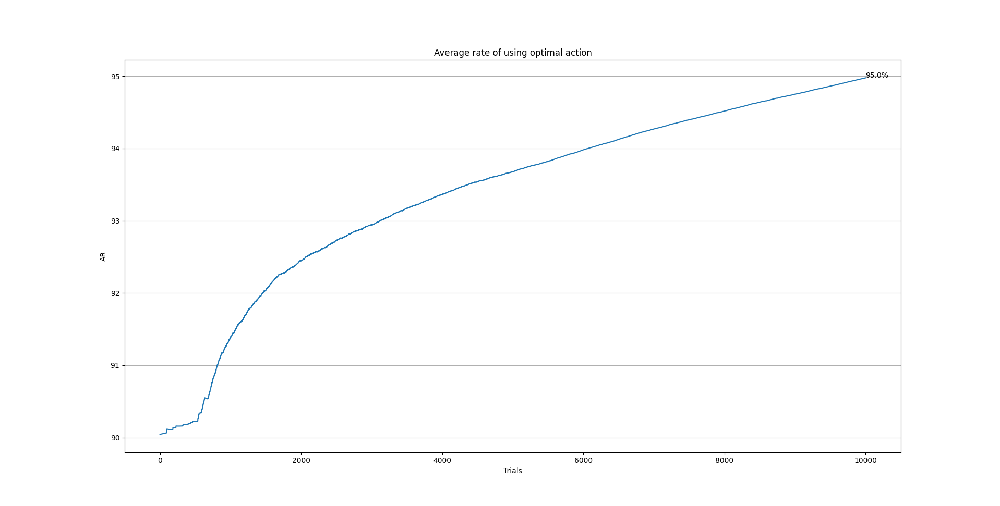
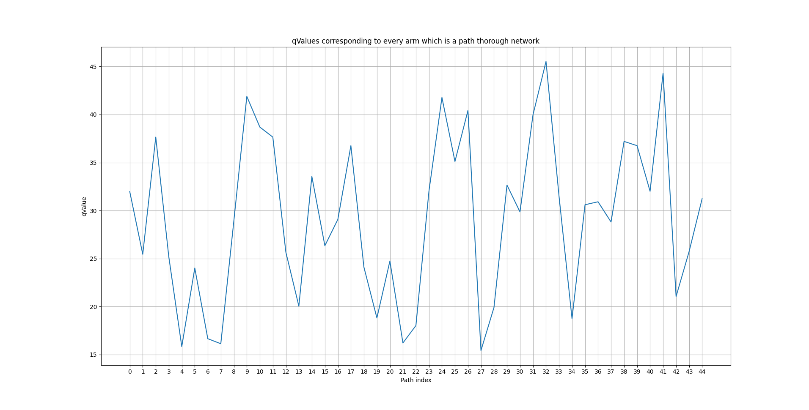
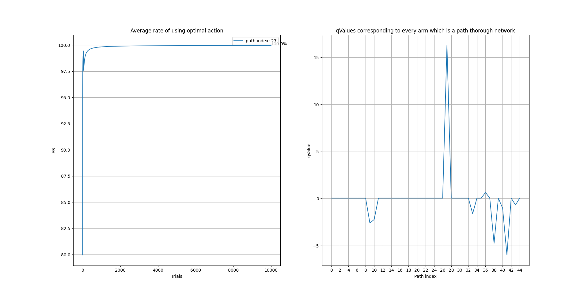
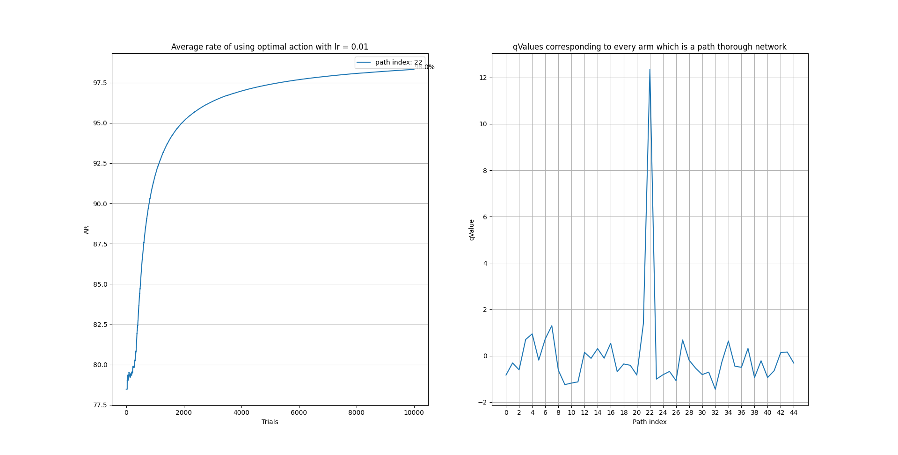
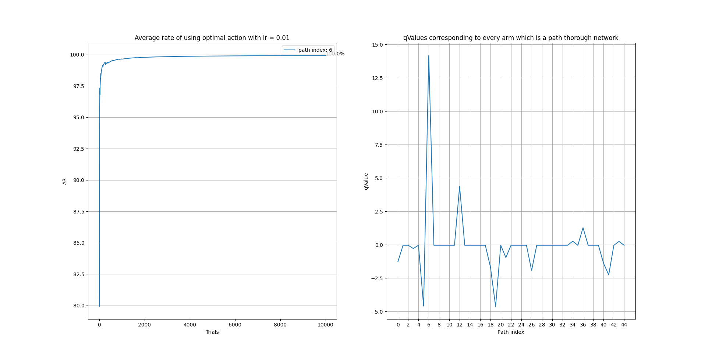
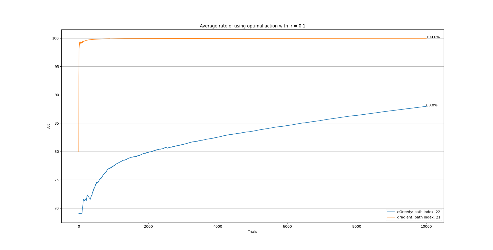
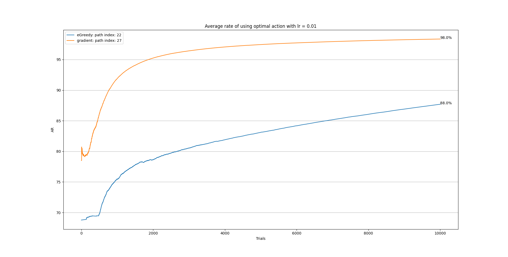

### Results part 3

In this part, we have designed an environment where an agent tries to find the best route for transferring a packet from one node to another node in a congested network. 

First, the rewards, actions, and other chief points are mentioned and justified. After that, we will illustrate the agent's performance exploiting two different policies which were used to choose the best action regarding the propensity of the agent to use certain route for transferring the packets. We used `gradient method` and `epsilon greedy` policies to choose between our available arms.

In addition to that, we have plotted the reward function used giving rewards to our agent by attending to their mean values and also the propabilities constituted the whole reward function. 

---

### Rewards, Actions

#### Rewards

The reward function was designed as mentioned in the task description. The delay we experience from using a specific route and transfer our packet using that route can be a good reward function. The integral point to notice is that in order to make our model maximize the rewards being observed, we are atending to negative value of the delays. In fact, the environment give us the delay we are experiencing in a certain route, while the agent uses the negative value of that to find the routes with minimum delays. 

#### Actions

The actions in this armed-bandit problem are the index of routes that our agent chooses. To clarify, we can take all the possible choices that our agent can choose and make a path through the network. By a simple math multiplication we can find 45 different routes. So, our task would be a 45-armed bandit and each arm would be a set of different decisions that the agent make confronting different choices in each node. By a depth-first search approach we can readily find each route with its index. To simplify the process of using arms and routes, we will use the forementioned index in the whole process.

--- 

### Optimistic Initialization

As you can see in the setup method for our agent, the qValues corresponded to each action was set somehow to be greater than the actual value of rewards. This was estimated by examining the reward function wholly. 

---

### Reward Function

To have a better insight into the environment where our agent is exploring and epxloiting, it would be good to know what the actual rewards do actually look like. 

|  | 
|:--:|
|*The actual rewards corresponded to each action*|

As you can see in the figure, the reward meets its climaxes in the points of indices of 4, 7, 22, 27, means that going through the route with indices number 4, 7, 22, 27 would be the best action that our agent can consider. That is reasonable on this ground that these routes go through nodes and links with least delays. For instance, you can see that node number 2 has a relatively low delay and also most of the links covered by these routes are green and blue which have less links compared to other links. __Also keep in mind that the best delay that the agent is capable of reaching is the delay amount of 15.__

---

### Epsilon Greedy

This section will demonstrate how epsilon greedy policy can perform in this task. The epsilon hyper-parameter was set to 0.5 in the first place and in time was reduced to zero to the mode of `full-exploitation`. Also the values corresponded to each action was estimated with a average approach. In other words, estimated value of using a certain action was calculated as the average rewards observed using that action. 

In the following you can see the results demonstrating the performance of the agent exploiting the eGreedy policy by its estimation of reward function.

|  | 
|:--:|
|*The average rate of using the best action - Agent's estimation of the reward function*|

you can see the Average rate of using the best action above, left handside. Also the agent's estimation of the reward function is depicted in its right. As you can see, the agent has learned that the `best action is the route with index 22`, and as a result of that, the average rate of using that action has converged to `95%`. 

For better understanding, you can see the single figures below:

|  | 
|:--:|
|*The average rate of using the best action*|

* you can see that by using this policy, our model is converging to using the best action it has found, and in fact it's doing a good job by reaching to the rate of `95 %`.

|  | 
|:--:|
|*Agent's estimation of the reward function*|

* Also another important point is that the estimated qValues that the agent has learned are significantly close to their actual values. All the routes with minimum delays compared to others have minimum estimated delays too. `As a result of that, the agent has learned that the delay experienced using the best route would be 15.`

---

### Gradient Method

This part will demonstrate the performance of using the Gradient Method policy for choosing between different arms. In the below figures you can see the plot depicting the average rate of using the `best action which are routes index 27, 22, 6 which means going through those routes will impose less delays than other routes.`

__Note that to be able to maximize the reward function, we have negated the delays and rewards, so the agent is trying to reach to the point that mostly uses the actions with maximum qValues.__

|  | 
|:--:|
|*The average rate of using the best action - Agent's estimation of the reward function with lr = 0.1*|

|  | 
|:--:|
|*The average rate of using the best action - Agent's estimation of the reward function with lr = 0.01*|

|  | 
|:--:|
|*The average rate of using the best action - Agent's estimation of the reward function with lr = 0.01*|

As you can see with higher learning rates the agent converges sooner to higher rates of using the best action. But all of them will eventually converge to the best action with a reasonable rate of using that action that is worth noticing.

`By looking at all figures, you can easily realize that the value that agent is estimating for the delay of using the best action is 15 just like the actual delay and the delay that our agent with epsilon greedy policy was trying to estimate.`

---

### Comparison between two policies

We can compare two policies in terms of their regrets and also their average rate of using the best action. With these two metrics, we can say which of these policies are better in what facet of doing the task of finding the best action. Although they both find the best action and they both will eventually converge to doing the best action, other characteristics of these models are slightly different from one another.

In the following figures you can see the average rate of using the best action for both of these policies together. For better results, before running the agents, the reward functions were made symmetric by using the same seed for their randomness.  

|  | 
|:--:|
|*The average rate of using the best action depicted for both policies with learning rate = 0.1*|

|  | 
|:--:|
|*The average rate of using the best action depicted for both policies with learning rate = 0.01*|

|  | 
|:--:|
|*The average rate of using the best action depicted for both policies*|

All of these figures show that the epsilon greedy policy is capable of converging to the best action and as you can see, it gets to some reasonable rate of using the best action after carrying out some number of trials. it converges to actually the best action and not the sub-optimum action like the gradient method. That is so conspicuous that the `learning rate has serious effect in the performance of the agent with gradient method policy` because the learning rate controls the degree to which the method is moving toward leaning upon the best action. With lower values of learning rate like `0.01`, the agent is more likely not to get stuck in a sub-optimal or local optimum as you can see in the second figure. While the learning rate has some effect on the performance, the overal performance of the gradient method can be considered better compared to the epsilon greedy policy. `The agent with epsilon greedy policy starts to converge to the best action somewhere after 1000 trials., while the agent exploiting the gradient method with high learning rate will starts to converge in the first 200 trials.`

### The best possible policy

Our answer to this secion depends heavily on the specific task that we are dealing with. Regarding the fact that the gradient method tries to act upon the preference for each action, the gradient method would be reasonable choice for handling the task at hand. By looking at the results we got and also the point that we are acting with a preference for the best action as time passes, that is so compelling that this policy would be great. The UCB policy would not be a great choice because the situation in this task don't involve rewards changing with time. `Also the epsilon greedy method would somehow blind and not exploiting the data gathered from the observed samples and rewards`. On this ground, `the gradient method policy would be better that its counterparts.` Since the thompson sampling policy, too, uses random samples from the distribution generated by the sampels and somehow have an approach akin to UCB, that would not be great choice. Having all these in mind, we cannot be sure about the performance of different policies on different task because of the stochastic origin and their speicific characteristics that each task has.