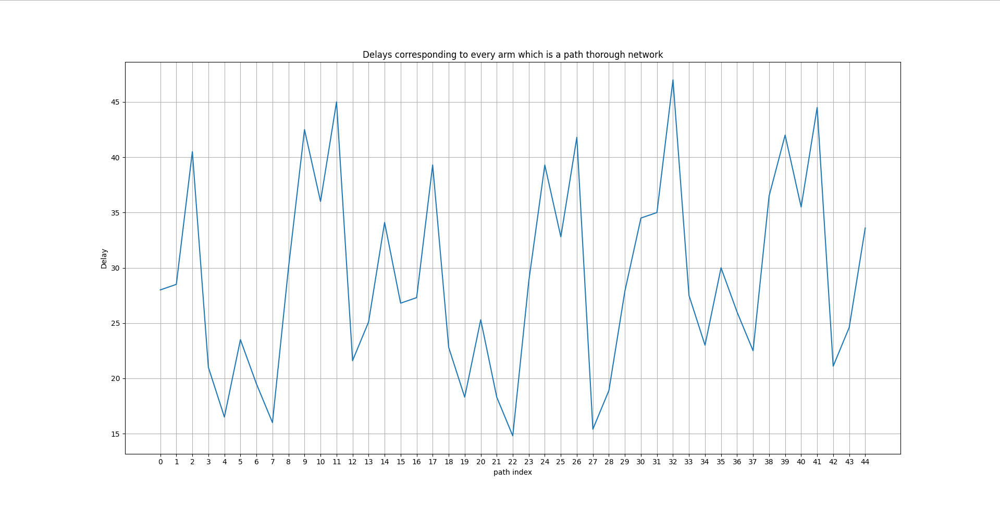

### Results part 3

In this part, we have designed an environment where an agent tries to find the best route for transferring a packet from one node to another node in a congested network. 

First, the rewards, actions, and other chief points are mentioned and justified. After that, we will illustrate the agent's performance exploiting two different policies which were used to choose the best action regarding the propensity of the agent to use certain route for transferring the packets. We used `gradient method` and `epsilon greedy` policies to choose between our available arms.

In addition to that, we have plotted the reward function used giving rewards to our agent by attending to their mean values and also the propabilities constituted the whole reward function. 

---

### Rewards, Actions

#### Rewards

The reward function was designed as mentioned in the task description. The delay we experience from using a specific route and transfer our packet using that route can be a good reward function. The integral point to notice is that in order to make our model maximize the rewards being observed, we are atending to negative value of the delays. In fact, the environment give us the delay we are experiencing in a certain route, while the agent uses the negative value of that to find the routes with minimum delays. 

#### Actions

The actions in this armed-bandit problem are the index of routes that our agent chooses. To clarify, we can take all the possible choices that our agent can choose and make a path through the network. By a simple math multiplication we can find 45 different routes. So, our task would be a 45-armed bandit and each arm would be a set of different decisions that the agent make confronting different choices in each node. By a depth-first search approach we can readily find each route with its index. To simplify the process of using arms and routes, we will use the forementioned index in the whole process.

--- 

### Optimistic Initialization

As you can see in the setup method for our agent, the qValues corresponded to each action was set somehow to be greater than the actual value of rewards. This was estimated by examining the reward function wholly. 

---

### Reward Function

To have a better insight into the environment where our agent is exploring and epxloiting, it would be good to know what the actual rewards do actually look like. 

|  | 
|:--:|
|*The actual rewards corresponded to each action*|

As you can see in the figure, the reward meets its climaxes in the points of indices of 4, 7, 22, 27, means that going through the route with indices number 4, 7, 22, 27 would be the best action that our agent can consider. That is reasonable on this ground that these routes go through nodes and links with least delays. For instance, you can see that node number 2 has a relatively low delay and also most of the links covered by these routes are green and blue which have less links compared to other links.

---

