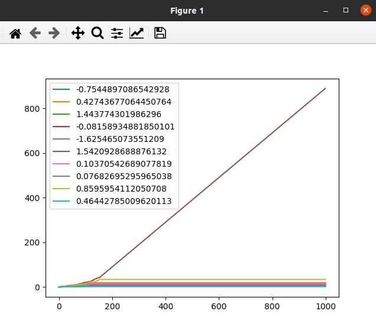
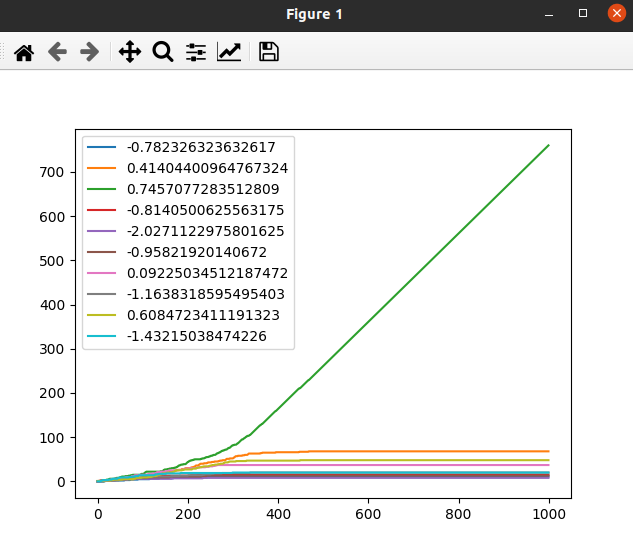
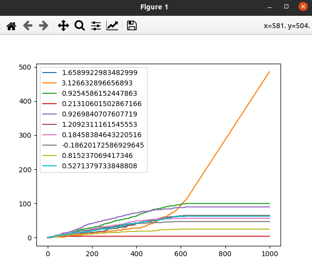
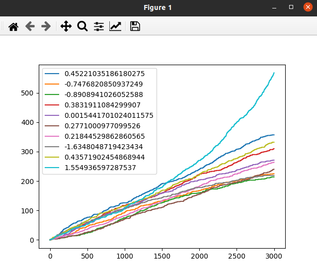
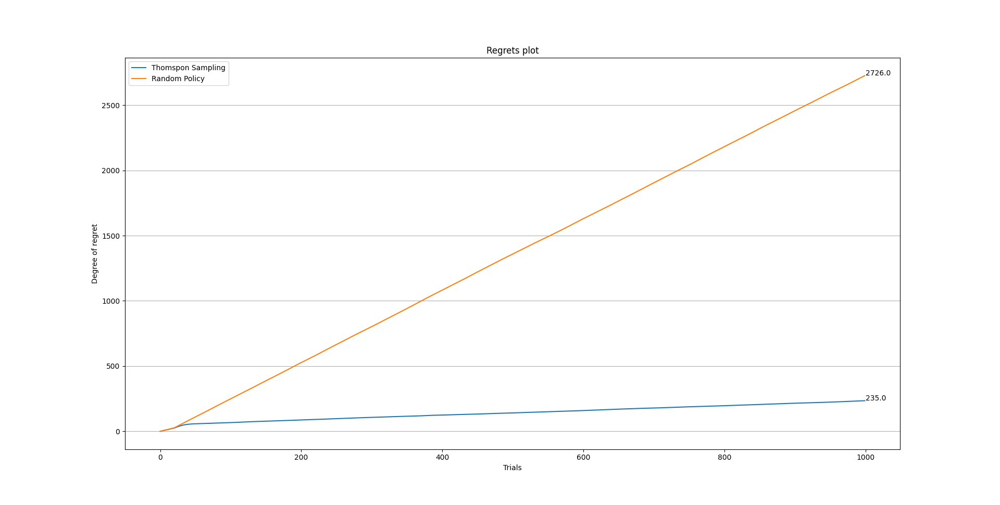
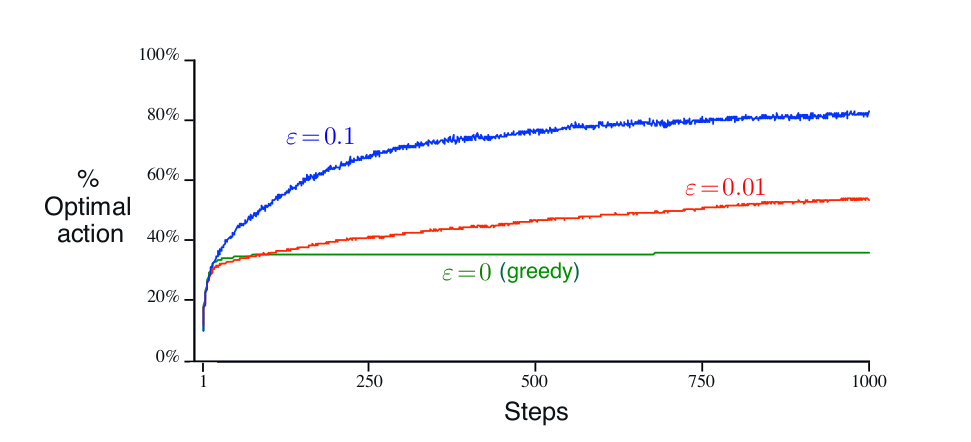

### Thompson Sampling and Greedy Policies

In this part we have examined the effect of using Thompson sampling policy for a 10 armed-bandit. The process of learning was in 1000 Trials and the whole process was repeated 20 times. Provided results are the mean values from 20 samples to make the results more robust. In the following, we have provided you the results and also the comparison have been made between them and the counterpart agent suggested by the Book `Reinforcement Learning An Introduction` by `Richard S. Sutton` and `Andrew G. Barto`.

---

In this part we have used the bayesian belief revision to find the optimal action between different actions with normal distribution rewards. In this path, the degree to which the estimated mean and variance are updating themselves was set to gradually decrease from __0.35__ to zero to converge in time. This value was chose by observing the impact of learning rate on the process of realizing the absolute value of mean and variance of different rewards.

* The policy used in this part was thompson sampling in which we pick samples from available actions of the environment considering our mindset about their mean and variance. That is brought about by the fact that we reckon all the rewards are conforming to a normal distribution. In this way we take actions in each timestep, get the corresponding reward, and update the mean and variance of the chosen action. 

* At first, the average rate of using optimal action was used to determine the validity of the model and observing the results. All the following plots are depicted with y axis of AR and x axis of number of trials. As you can see the effect of using reasonable learning rate is indisputable.

lr = 0.1             |  lr = 0.01
:-------------------------:|:-------------------------:
  |  

lr = 0.001             |  lr = 0.0001
:-------------------------:|:-------------------------:
 | 

* The y axis shows the number of times that agent uses a specific action and x axis shows the number of trials.
* Each curve represents one action. The average mean of the actions are depicted in the legend.

---

In the following figures, you can observe the performance of the model in terms of rate of using the best action agent can opt to act upon it. In addition to that, the figures corresponded to the amount of regret compared to a random policy agent was depicted to somehow illustrate the effect of our `Thompson Sampling` policy in mitigating the regret that our agent is sensing.

|  | 
|:--:| 
| *Average rate of using the best action* |

|  | 
|:--:|
|*Regret that was sensed by the Agent in time*|

 

* As you can see our agent is doing way more better than a random policy agent in sensing regrets from the environment. Also that is worth to note that the average rate of using the best action,too, is noticeably good. This matter is brought about by the fact that the mean rewards are too dense in a relatively small area. So, being able to converge to some action and ignoring the other sub-optimal actions would be a good option featuring in our results. 

---

|  | 
|:--:|
|*Average rate of using the best action acting upon a greedy policy*|

*The greedy method performed significantly worse in the long run because it often got stuck performing suboptimal actions*

*The eGreedy methods eventually performed better because they continued
to explore and to improve their chances of recognizing the optimal action.*

* Compared to what is alluded to in the book I referred to before, our model is doing better in terms of always finding the best possibel action, and also in reaching better rate compared to the eGreedy or greedy. Because of the stochastic origin our reward function possesses, we had to carry out certain number of executions to be sure that our model is doing well. After doing that, we can entirely be sure that the rate of using the best action would be absolutely better than some threshold above `80%` which is better than the performance of models mentioned in the book.