### Waiting Time Monetary Value with Prospect Theory

In this part, we have designed an environment where an agent tries to find the best waiting time for bus considering the amount of money the agent wants to save and also the time when it arrives at the university to attend the class. Note that because of the stochasticness that this task has, some of the rates or results may vary slightly. 

First, the rewards, utility function and other chief points are mentioned and justified. After that, we will illustrate the agent's performance exploiting two different policies which were used to choose the best action regarding the propensity of the agent to arrive sooner or later or save more money. We used `UCB` and `epsilon greedy` policies to choose between our available arms.

In addition to that, we have plotted the reward function used giving rewards to our agent by attending to their mean values and also the propabilities constituted the whole reward function. 

Another essential information about our model is that it exploits an subjective approach reacting to the observed reward. Note that all the hyper-parameters were thoroughly examined with different settings. Besides, they were chosen carefully to comply with the reward function and weight function introduced in `Prospect theory` by `Daniel Kahneman `and `Amos Tversky`

---

### Rewards, Utility Function, Actions

#### Rewards

The reward function was designed as a Normal distribution reward function with the mean value of 6 and the standard deviation of 4. 
These values show when the bus is going to arrive at the station where our agent is patiently waiting. Since the negative values comming out of this reward function should be ignored, we take as much as samples from this distribution to find the values justifying the constraints imposed on our reward function. __Also note that the rewards are compared to a delay-border which is the time when arriving after that would penalize the agent.__

#### Actions

The actions in this armed-bandit problem are the amount of waiting that our agent chooses. To include all possible amounts of waiting, our agent was set to choose between amounts in the range of two standard deviation of our reward function's mean value. On this ground, our actions range from 0 to 14. That means that our agent is capable of choosing between waiting 0 minutes to 14 minutes. To clarify, we have 14 arms corresponding to agent's waiting time.

#### Utility Function

Our agent is designed to apply a subjective value of rewards to the observed reward in terms of reward and punishment values that our agent sees the rewards through those glasses. 
Our agent incorporates the approach of `Prospect theory` to the observed rewards. 

| 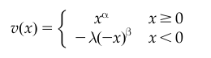 | 
|:--:|
|*The value Function suggested by prospect theory*|

Having this model in mind, we have designed a utility function akin to the mentioned value function. Our model uses `lambda value of 5` for avoiding punishments. `Alpha and beta values of 0.88 and 1.5`, respectively, were used to incorporate a non-linearity to our subjective value. `The monetary value of 8.5` was set based on our experiments using different set of monetary values. This value somehow shows the degree to which we care to spend less money and save. `The delay border of 10` illustrate the point further that we would miss the class. `The epsilon value of 0.5 `was initially set and gradually decreases as we go through more sample data. This hyper-parameter was used in the epsilon greedy policy which was one of our chosen policies. By reducing the amount of epsilon with time we switch from a exploration mode of using actions to a greedy exploitation of using the best actions. __Another point in our model is usage of the hyper-parameter c which penelizes the agent for missing the class more and more as the time passes exponentially.__

---

### Reward Function

To have a better insight into the environment where our agent is exploring and epxloiting, it would be good to know what the actual rewards do actually look like. 

| 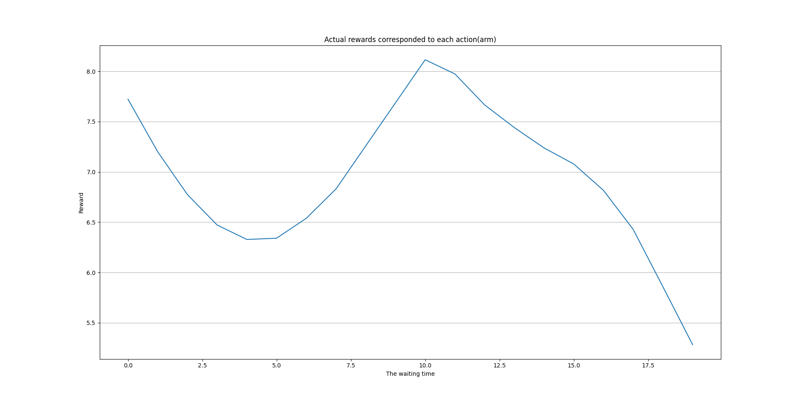 | 
|:--:|
|*The actual rewards corresponded to each action*|

As you can see in the figure, the reward meets its climax in the point of 10 means that waiting 10 minutes would be the best action that our agent can consider. That is reasonable on this ground that the monetary value would outweigh the situation reward in which the agent would get to its class sooner. Moreover, you can notice that waiting zero time and get to the class ASAP, too, is actually a reasonable choice for agent. That is because the designed reward function put a lot of value in getting to the class sooner, but not as much as saving money. __Getting to the class later and missing the class would not be a considerable choice for agent as you can see in the figure as a result of penelizing the agent for missing the class.__

--- 

### Optimistic Initialization

As you can see in the setup method for our agent, the qValues corresponded to each action was set somehow to be greater than the actual value of rewards. This was estimated by examining the reward function wholly. 

---

### Epsilon Greedy

This section will demonstrate how epsilon greedy policy can perform in this task. The epsilon hyper-parameter was set to 0.5 in the first place and in time was reduced to zero to switch to the mode of `full-exploitation`. Also the values corresponded to each action was estimated with an average approach. In other words, estimated value of using a certain action was calculated as the average rewards observed using that action. 

In the following you can see the results demonstrating the performance of the agent exploiting the eGreedy policy by its estimation of reward function.

| 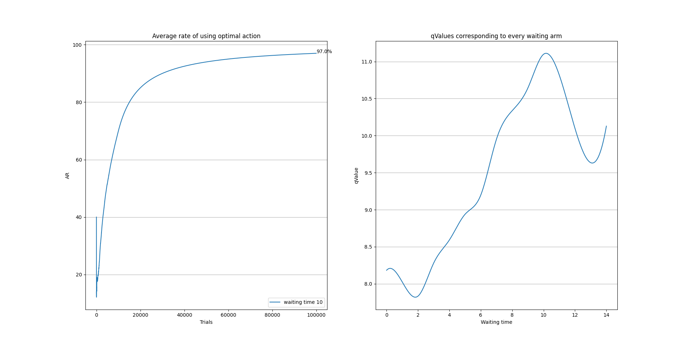 | 
|:--:|
|*The average rate of using the best action - Agent's estimation of the reward function*|

you can see the average rate of using the best action above, left handside. Also the agent's estimation of the reward function is depicted in its right. As you can see, the agent has learned that the `best action is waiting 10 minutes`, and as a result of that, the average rate of using that action has converged to `97%`. 

One of most important things that we can conspicuously say from the charts modeling the class-arriving task is that the monetary value regarding the value of time is so potent that adjusting this hyper-parameter can largely impact the convergance of our model. 

After some trials and also by adjusting the hyper-parameters that were cardinal factors in describing the behvaior and the decision making of the people regarding the period of time they wait for the bus service to save money, I found that the value that we assign to getting the class with delay and also the relative monetary value would be considerably determining. 

By changing this monetary value from lower values to higher values, the value of time can readily outweigh the value of money. But at the point that monetary value is making a equilibrium with the value of early arriving, we can see that the model is considering options other than just taking taxi and getting too soon to the university. These finding are depicted in the following figure.

| 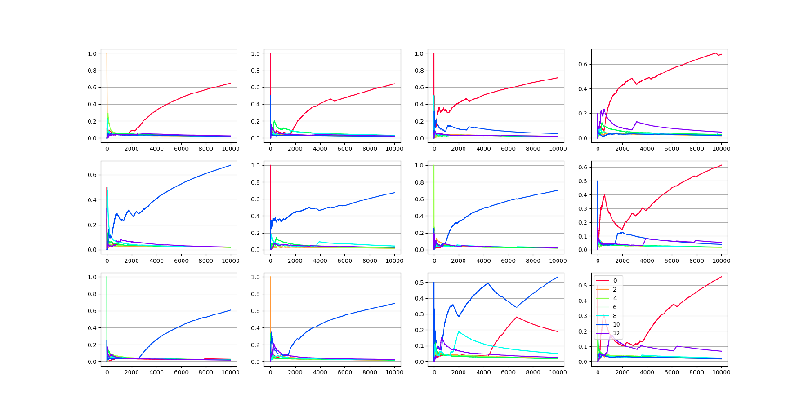 | 
|:--:|
|*The average rate of using the best action shifting from lower monetary values to higher monetary values(red lines show waiting time of zero minutes and blue lines show the waiting time of 10 minutes)*|

---

### UCB

This part will demonstrate the performance of using the UCB policy for choosing between different arms. In the below figures you can see the plot depicting the average rate of using the best action which is arm number 10 which means waiting 10 minutes before getting a taxi.

| 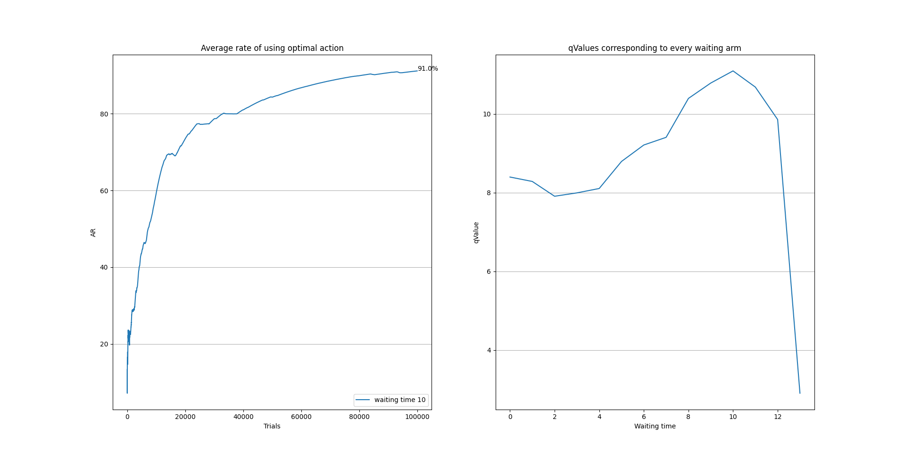 | 
|:--:|
|*The average rate of using the best action - Agent's estimation of the reward function with c = 2*|

| 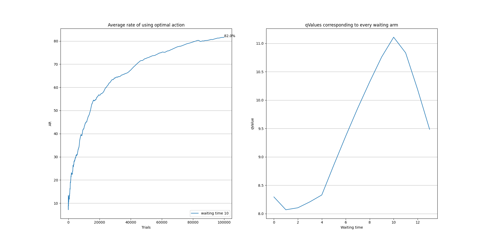 | 
|:--:|
|*The average rate of using the best action - Agent's estimation of the reward function with c = 5*|

| 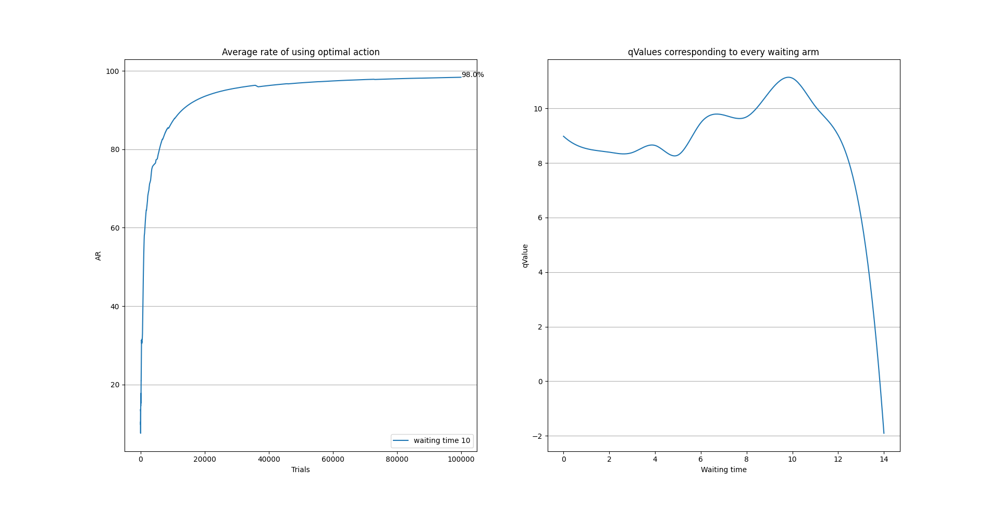 | 
|:--:|
|*The average rate of using the best action - Agent's estimation of the reward function with c = 10*|

As you can see with higher c values that correspond to the more regret for getting late for the class, the agent converges sooner to higher rates of using the best action. But all of them will eventually converge to the best action with a reasonable rate of using that action that is worth noticing.

---

### Comparison between two policies

We can compare two policies in terms of their regrets and also their average rate of using the best action. With these two metrics, we can say which of these policies are better in what facet of doing the task of finding the best action. Although they both find the best action and they both will eventually converge to doing the best action, other characteristics of these models are slightly different from one another.

In the following figures you can see the average rate of using the best action for both of these policies together. For better results, before running the agents, the reward functions were made symmetric by using the same seed for their randomness.  

| 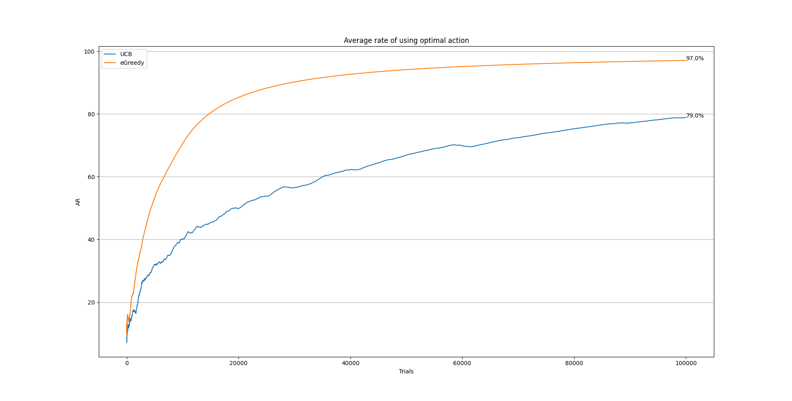 | 
|:--:|
|*The average rate of using the best action depicted for both policies*|

| 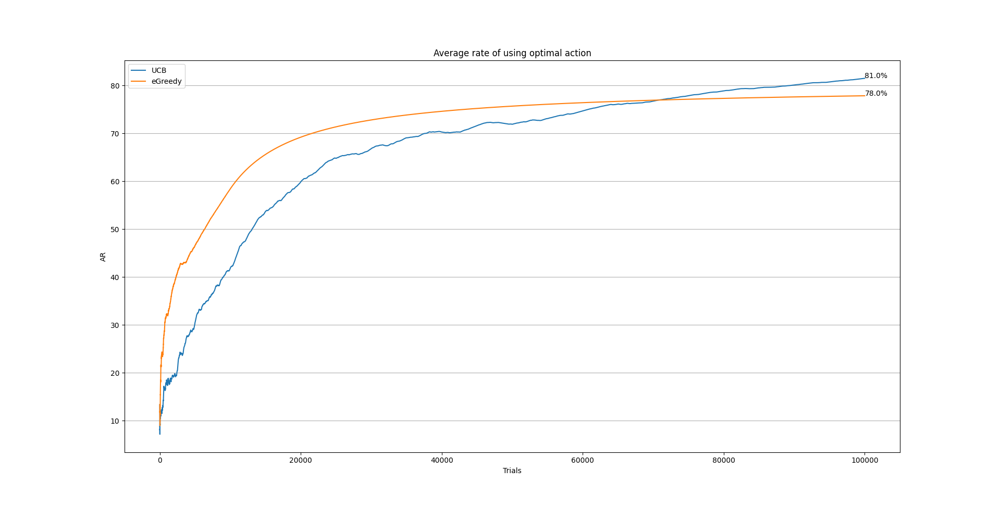 | 
|:--:|
|*The average rate of using the best action depicted for both policies*|

| 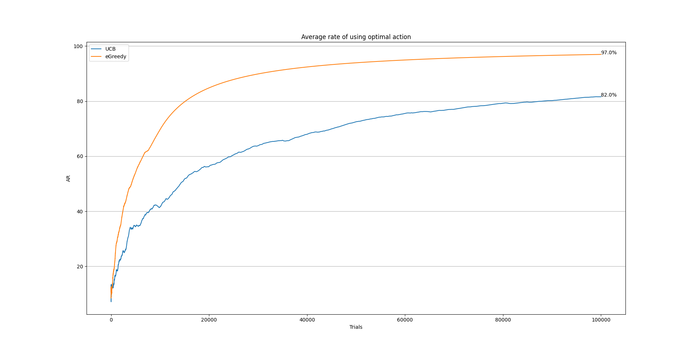 | 
|:--:|
|*The average rate of using the best action depicted for both policies*|

All of these figures show that the epsilon greedy policy is capable of converging sooner to the best action and as you can see, it gets to some reasonable rate of using the best action just after carrying out some number of trials. But that is so conspicuous from the second figure that it is entirely possible that the UCB gets to some better rate even after carrying out so many trials. The fact that the UCB policy can consider all the choices it has with time passing and attending to less attended choices wholly justifies this observation. In contrast to the epsilon greedy policy in which the tendency to choose the best action found till that specific trial will keep rising to reach the full-exploitation.

| 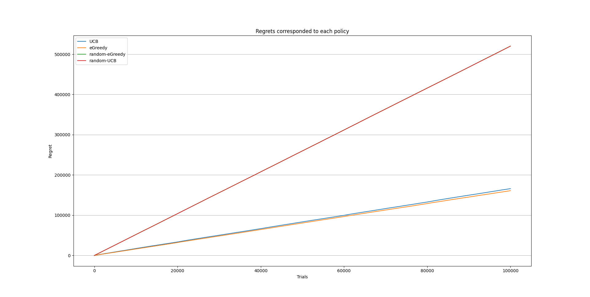 | 
|:--:|
|*The regret that agents with each policy experience as well as regret observed from random-policy agent*|

As you can notice from this figure, the regret each agent with their policies experience is reasonably better than the regret that agent with random policy senses, but the regret between two agents themselves don't have a noticeable difference. 